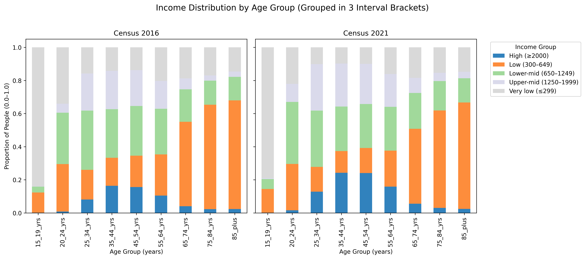
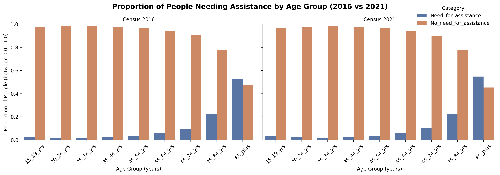

# Australian Census Income & Assistance Analysis (2016 vs 2021)
## Overview
This project is a data analysis investigation exploring how personal income and core activity assistance needs vary across age groups using Australian Bureau of Statistics (ABS) Census data.

The analysis compares trends between the 2016 and 2021 Census datasets to examine the relationship between financial disadvantage and health-related vulnerability.

## Project Objective
To analyse how income distribution and assistance needs vary across age groups and how these patterns have changed over time.  

## Repository Structure
```
australian-income-assistance-analysis/
├── data/                                              (raw datasets, to be downloaded by user)
│   ├── 2016_GCP_AUS_for_AUS_short-header/        
│   │   ├── 2016_Census_GCP_Australia_for_AUS/     
│   │   ├── Metadata/                             
│   │   └── README/                                
│   ├── 2021_GCP_AUS_for_AUS_short-header/
│   │   ├── 2021_Census_GCP_Australia_for_AUS/         (CSV files with all tables of data)
│   │   ├── Metadata/                                  (summary spreadsheets of each table)
│   │   └── README/                                    (text files overviewing datapacks and terminologies used)
│   └── README.md                                      (instructions to download datasets)
├── figures/                                           (saved graph images)
│   ├── assistance_vs_age.png                          
│   └── income_vs_age.png
├── notebook/
│   └── census-income-assistance-analysis.ipynb        (this jupyter notebook) 
├── .gitignore
├── index.html                                         (saved html report)
├── README.md
└── requirements.txt
```

## Quick View (No Setup Required)

If you prefer not to run the notebook, you can view the full analysis directly:

Clicking the GitHub pages link under the repository's About section or by pasting this link in your search engine's address bar:
```
https://kambytes.github.io/australian-income-assistance-analysis/index.html
```
This contains the complete notebook with all outputs and visualisations.

OR

Open the jupyter notebook .ipynb file located in:
```
notebook/census-income-assistance-analysis.ipynb
```

## Setup & Usage

### 1. Clone repository

```bash
git clone https://github.com/kambytes/australian-income-assistance-analysis
cd australian-income-assistance-analysis
```

### 2. Create virtual environment
```bash
python -m venv .venv
source .venv/bin/activate      # Run this if on Mac/Linux
.venv\Scripts\activate         # Run this if on Windows
```

### 3. Install dependencies
```bash
pip install -r requirements.txt
```

### 4. Run the project
```bash
jupyter notebook
```

Inside Jupyter Notebook, open:
```
notebook/census-income-assistance-analysis.ipynb
```

## Key Insights
- **Assistance needs increase sharply with age**, particularly from 65+, with the highest levels observed in the 75+ population.
- **Income follows a life-cycle pattern** — rising from early adulthood, peaking in mid-career (35–54), and declining significantly after retirement.
- **Older Australians (75+) face a dual burden of financial and health disadvantage**, combining high assistance needs with lower income levels.
- **Younger groups (15–24) also have low income**, but minimal assistance needs, indicating a different type of financial dependence.
- **The intersection of low income and high assistance needs is concentrated in older age groups**, highlighting a compounding vulnerability.
- **Patterns remain consistent between 2016 and 2021**, with a slight increase in assistance needs likely reflecting an ageing population.

## Key Visual Insights

### Income Distribution by Age


### Assistance Needs by Age


---
## Dataset
Source: Australian Bureau of Statistics (ABS)
https://www.abs.gov.au/census/find-census-data/datapacks

Datasets used:
- **G17B & G17C** Total Personal Income (Weekly) by Age by Sex (2016 & 2021)
- **G18** Core Activity Need for Assistance by Age by Sex (2016 & 2021)

Raw datasets are not included due to size. See **data/README.md** for instructions.

## Technologies & Skills
**Language:**
- Python  

**Libraries:**
- pandas    
- matplotlib  
- seaborn  
- jupyter notebook

**Skills Demonstrated:**
- Understanding and application of data science lifecycle
- Data cleaning and preprocessing  
- Exploratory data analysis (EDA)  
- Data visualisation  
- Working with real-world census datasets  
- Analytical reasoning and interpretation

**Author:** Kamleshkumar Senthilkumar  
<<<<<<< HEAD
**Completed:** 24th September 2025
=======
**Completed:** 24th September 2025
>>>>>>> 5a497d18c08acef653263c76928d4719f3fbe2ba
